# Mermaid Sample

DocBaseの「Mermaid 記法と書き方」の主要図を、通常の ` ```mermaid ` コードブロックでそのまま描画できる形でまとめたページです。

元記事: https://help.docbase.io/posts/3719897

## 1. フローチャート

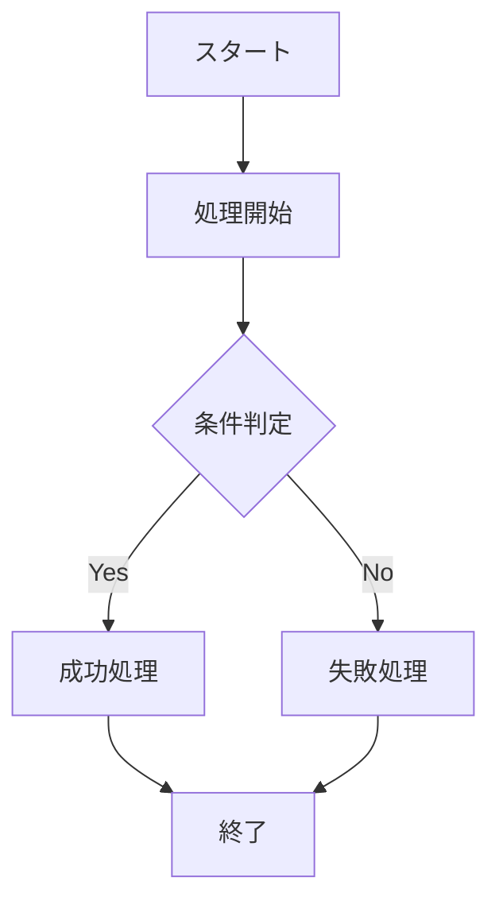

## 2. シーケンス図

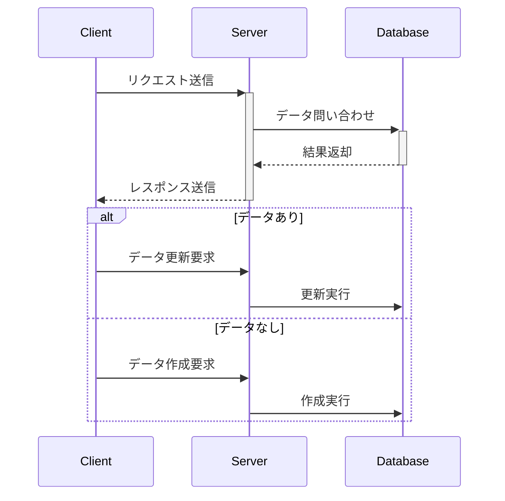

## 3. クラス図

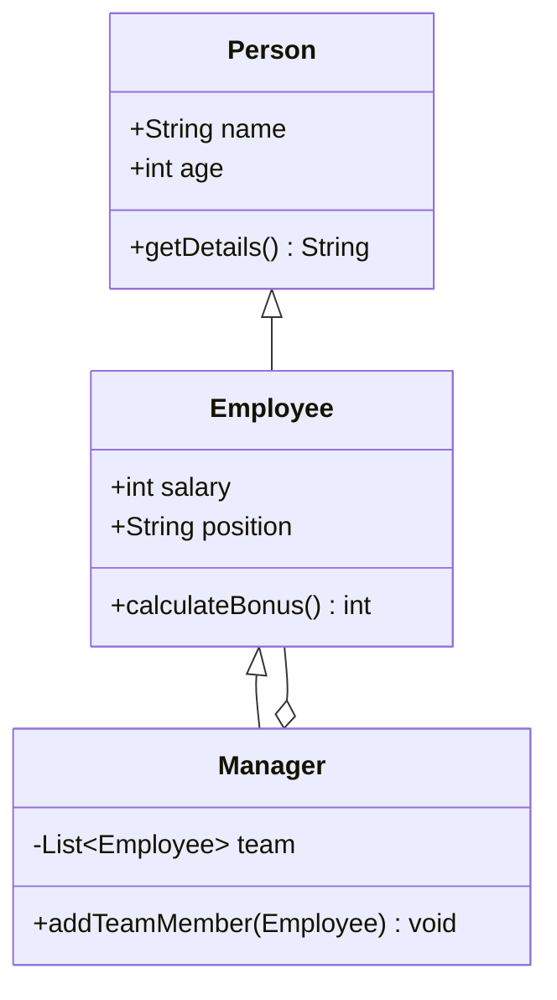

## 4. 状態図

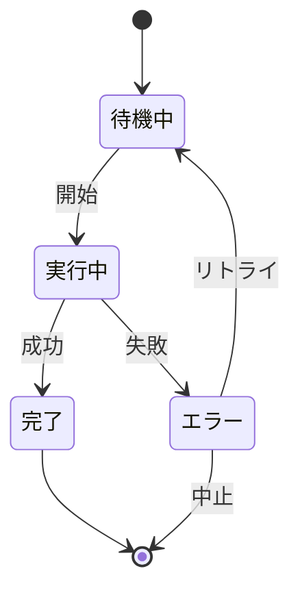

## 5. ER図

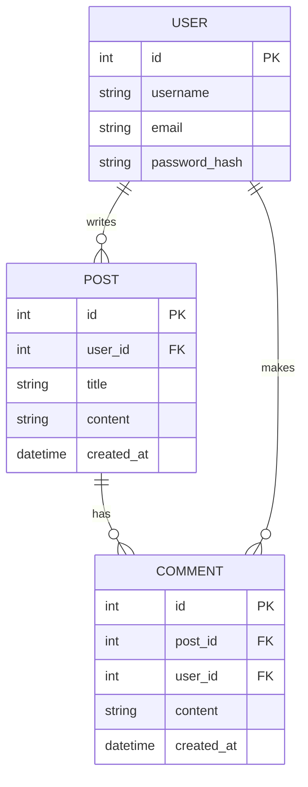

## 6. ガントチャート

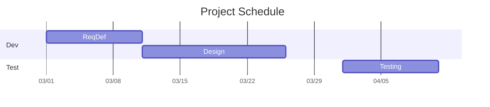

## 7. ジャーニーチャート

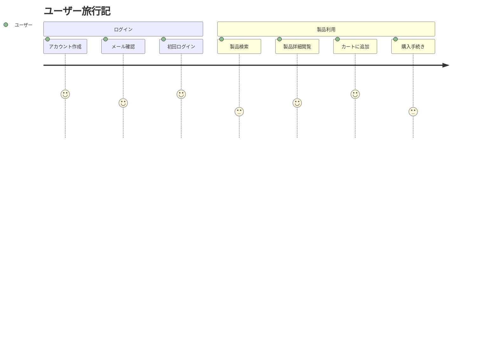

## 8. Gitグラフ

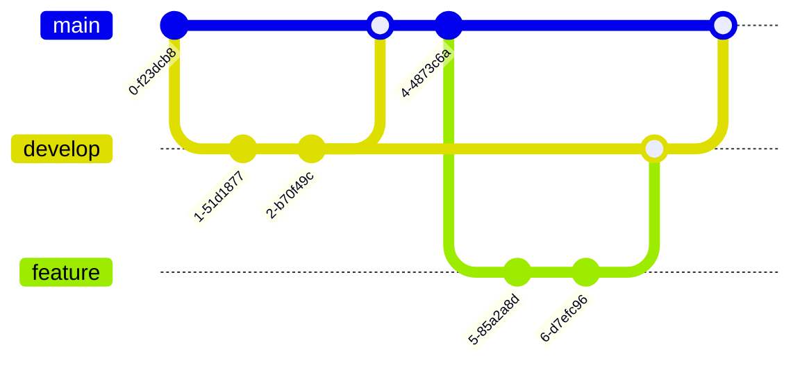

## 9. パイチャート

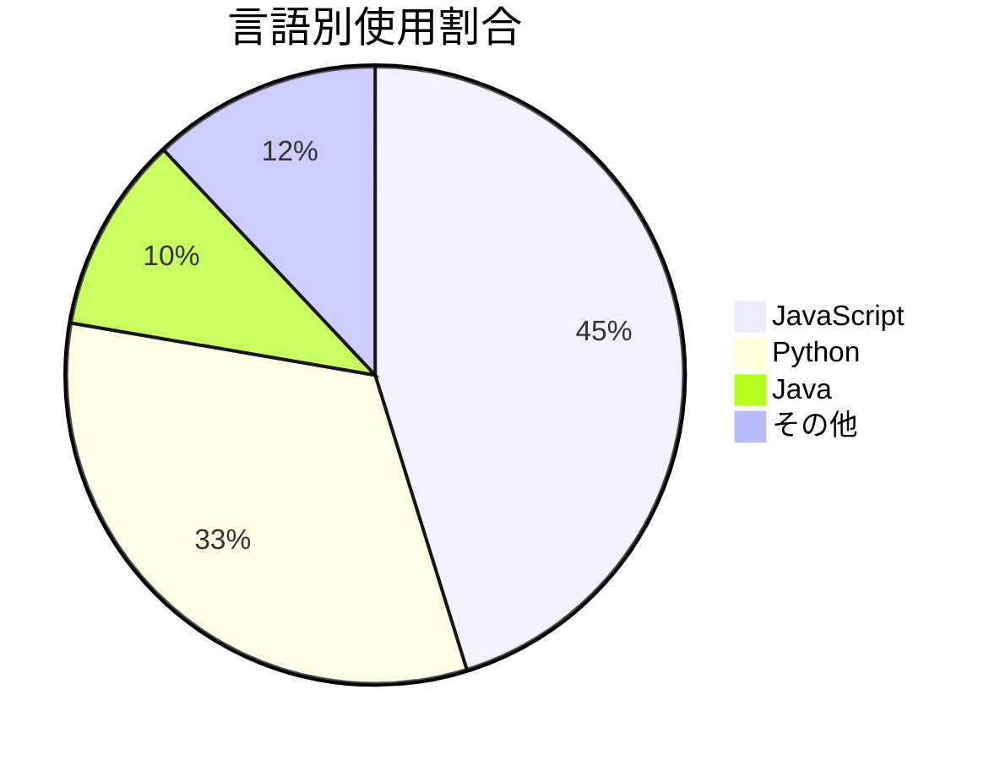

## 10. 要件図

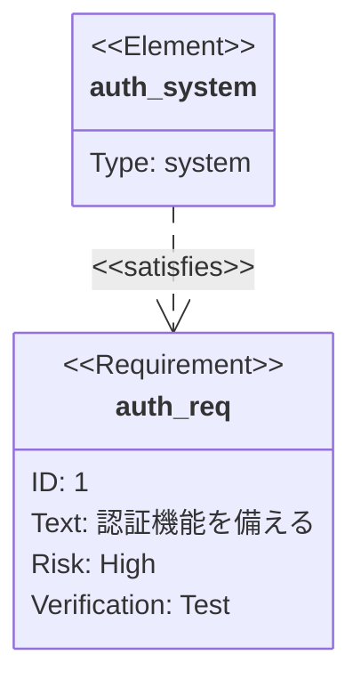

## 11. C4 図

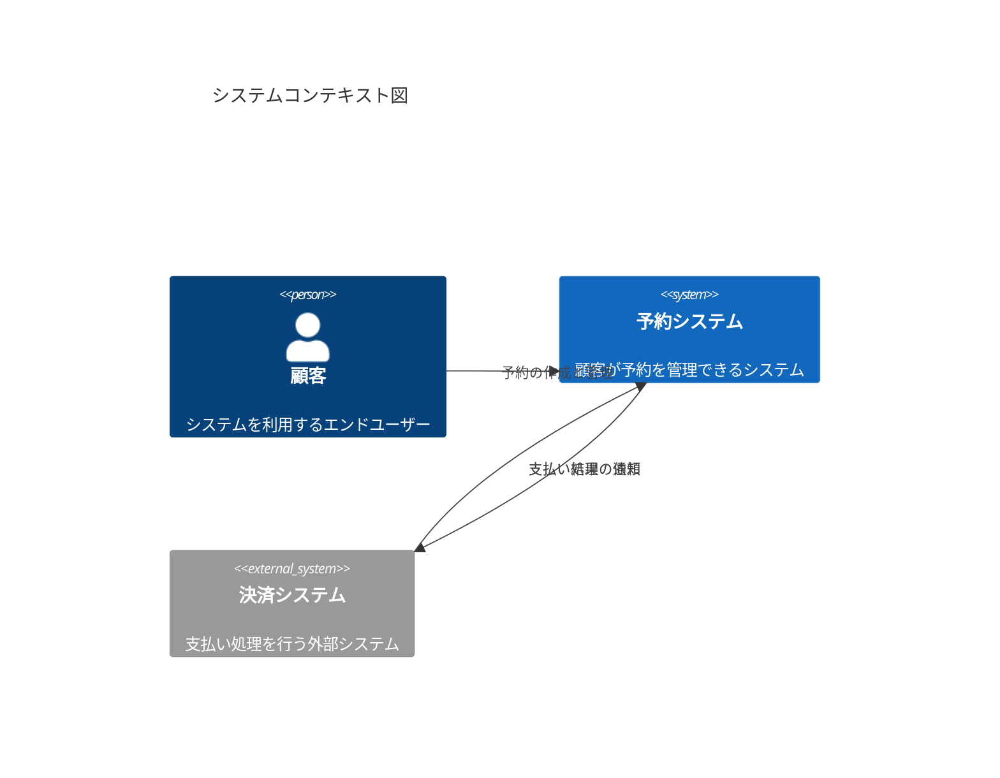

## 12. アーキテクチャ図

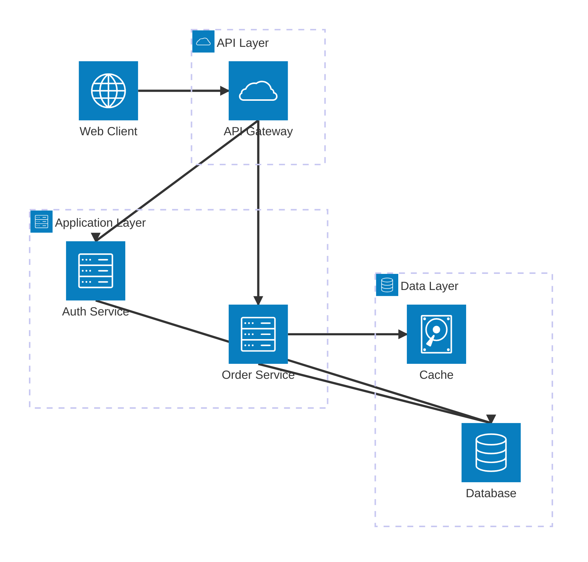

---

## よくあるエラーと対処

- 図が出ない: Mermaid構文エラー（行末や記号）を確認
- 複雑すぎる: 図を分割して読みやすくする
